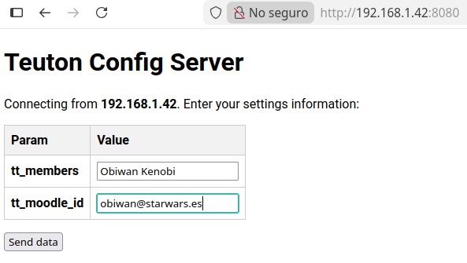
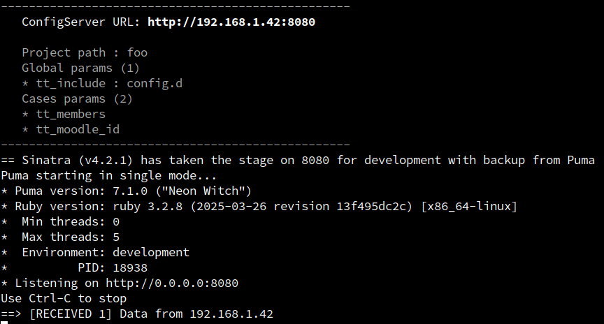

[<< back](../../README.md)

# config

_Help to create config file._

Usage:
* `teuton config DIRECTORY`
* `teuton config --server DIRECTORY`

## Suggest config content

* This is our test file content.

```ruby
# File: examples/03-remote_hosts/start.rb`

group "Remote host" do
  target "Create user root"
  run "id root", on: :host1
  expect ["uid=", "(root)", "gid="]

  target "Delete user vader"
  run "id vader", on: :host1
  expect_fail
end

play do
  show
  export
end
```

* Run `teuton config examples/03-remote_hosts` to suggest config file content:

``` 
---
global:
cases:
- tt_members: VALUE
  host1_ip: VALUE
  host1_username: VALUE
  host1_password: VALUE
```

## Init Config Server

_Initialize Config Server, so students connect and help to build config file content._

* Project files:
```
foo
├── config.yaml
└── start.rb
```

* `teuton config --server foo`, init config server.
```
--------------------------------------------------
   ConfigServer URL: http://192.168.1.42:8080

   Project path : foo
   Global params (0)
   Cases params (2)
   * tt_members
   * tt_moodle_id
--------------------------------------------------
== Sinatra (v4.2.1) has taken the stage on 8080 for development with backup from Puma
Puma starting in single mode...
* Puma version: 7.1.0 ("Neon Witch")
* Ruby version: ruby 3.2.8 (2025-03-26 revision 13f495dc2c) [x86_64-linux]
*  Min threads: 0
*  Max threads: 5
*  Environment: development
*          PID: 18938
* Listening on http://0.0.0.0:8080
Use Ctrl-C to stop
```

* Now students connect to host 192.168.1.42 and send their configuracion values.
* Student host:



* Teacher host:



* When all students submit their data, the teacher presses CTRL-C to end the service
* The received data is saved in separate files within the `config.d` subfolder
* Project files:
```
foo
├── config.d
│   ├── remote_127.0.0.1.yaml
│   ├── remote_192.168.1.14.yaml
│   └── remote_192.168.1.28.yaml
├── config.yaml
└── start.rb
```

* And now the main configuration file (config.yaml) has the following content:
    * Global param `tt_include: config.d`. 
    * No cases in main config file. Read case data from files into `config.d` subfolder.

```yaml
---
global:
  tt_include: config.d
cases: []
```
