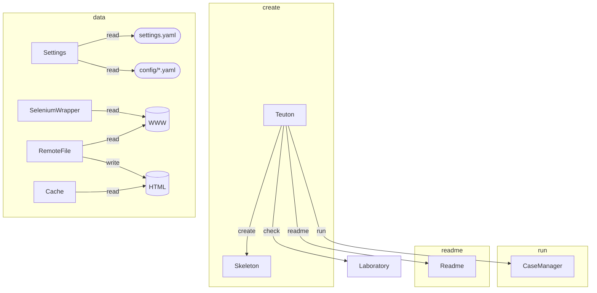

[<<back](../README.md)

# Diagram

```mermaid
flowchart TB

Teuton -- check --> Laboratory

subgraph create
  Teuton -- create --> Skeleton
end

subgraph run
  Teuton -- run --> CaseManager
end

subgraph readme
  Teuton -- readme --> Readme
end

subgraph data
  Settings -- read --> settingsyaml([settings.yaml])
  Settings -- read --> configyamls([config/*.yaml])
  RemoteFile -- read --> www[(WWW)]
  SeleniumWrapper -- read --> www[(WWW)]
  Cache -- read --> html[(HTML)]
  RemoteFile -- write --> html[(HTML)]
end
```
