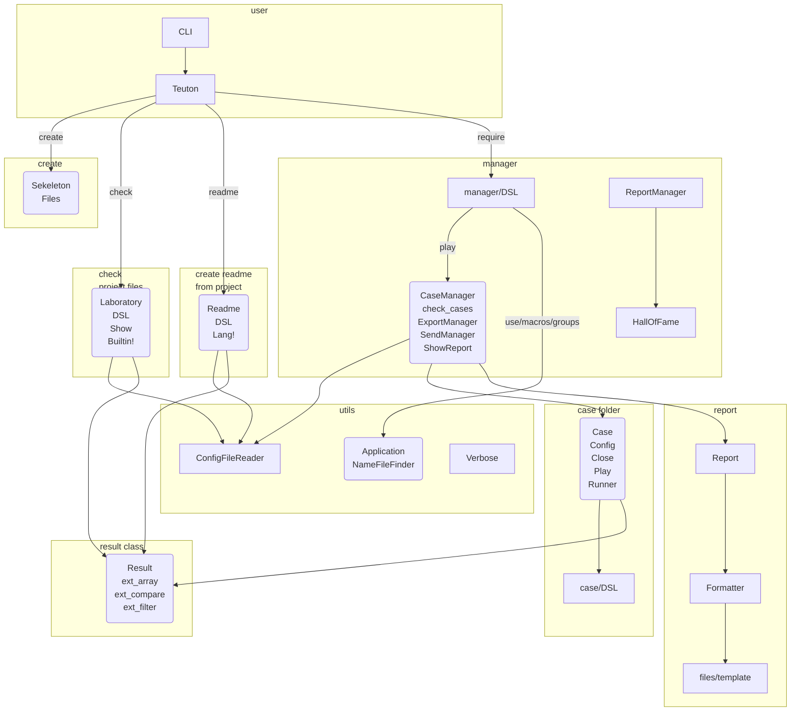

[<<back](../README.md)

# Diagram

```mermaid
flowchart TB

subgraph user
  CLI --> Teuton
end

subgraph "create\nnew\nproject"
  Teuton -- create --> Skeleton("Sekeleton\nFiles")
end

subgraph "check\nproject files"
  Teuton -- check --> Laboratory("Laboratory\nDSL\nShow\nBuiltin!")
end

subgraph "create readme\nfrom project"
  Teuton -- readme --> Readme("Readme\nDSL\nLang!")
end

subgraph manager
  Teuton -- require --> manager/DSL
  manager/DSL -- play --> CaseManager("CaseManager\ncheck_cases\nExportManager\nSendManager\nShowReport")
  ReportManager --> HallOfFame
end

subgraph utils
  manager/DSL -- use/macros/groups --> Application("Application\nNameFileFinder")
  Readme --> ConfigFileReader
  Laboratory --> ConfigFileReader
  CaseManager --> ConfigFileReader
  Verbose
end

subgraph "case folder"
  CaseManager --> Case("Case\nConfig\nClose\nPlay\nRunner")
  Case --> case/DSL
end

subgraph "result class"
  Laboratory --> Result
  Readme --> Result("Result\next_array\next_compare\next_filter")
  Case --> Result
end

subgraph report
  CaseManager --> Report
  Report --> Formatter
  Formatter --> files/template
end
```
