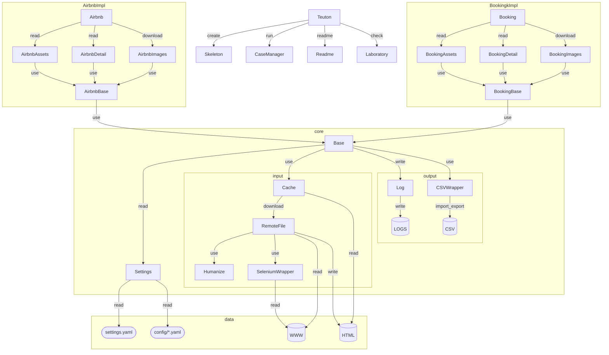

[<<back](../README.md)

# Diagram

```mermaid
flowchart TB

Teuton -- create --> Skeleton
Teuton -- run --> CaseManager
Teuton -- readme --> Readme
Teuton -- check --> Laboratory

subgraph AirbnbImpl
  Airbnb -- read --> AirbnbAssets
  Airbnb -- read --> AirbnbDetail
  Airbnb -- download --> AirbnbImages

  AirbnbAssets -- use --> AirbnbBase
  AirbnbDetail -- use --> AirbnbBase
  AirbnbImages -- use --> AirbnbBase
end

subgraph BookingkImpl
  Booking -- read --> BookingAssets
  Booking -- read --> BookingDetail
  Booking -- download --> BookingImages

  BookingAssets -- use --> BookingBase
  BookingDetail -- use --> BookingBase
  BookingImages -- use --> BookingBase
end

subgraph core
  AirbnbBase -- use --> Base
  BookingBase -- use --> Base
  Base -- read --> Settings
  Base -- use --> Cache
  Base -- write --> Log
  Base -- use --> CSVWrapper

  subgraph output
    CSVWrapper -- import_export --> csv[(CSV)]
    Log -- write --> logfile[(LOGS)]
  end

  subgraph input
    Cache -- download --> RemoteFile
    RemoteFile -- use --> Humanize
    RemoteFile -- use --> SeleniumWrapper
  end
end

subgraph data
  Settings -- read --> settingsyaml([settings.yaml])
  Settings -- read --> configyamls([config/*.yaml])
  RemoteFile -- read --> www[(WWW)]
  SeleniumWrapper -- read --> www[(WWW)]
  Cache -- read --> html[(HTML)]
  RemoteFile -- write --> html[(HTML)]
end
```
