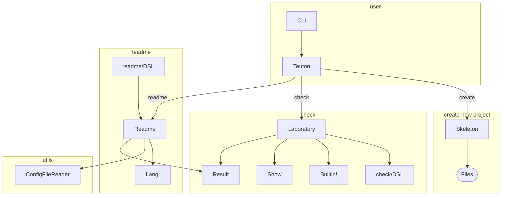
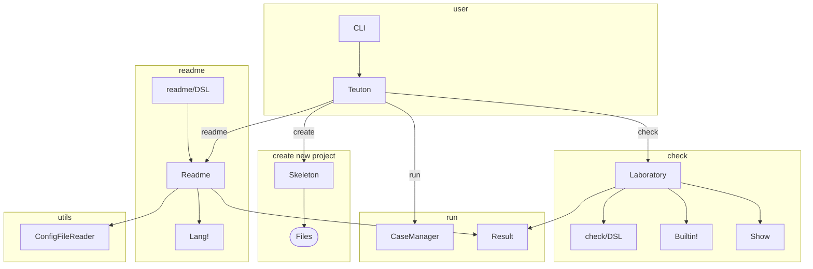

[<<back](../README.md)

# Diagram

```mermaid
flowchart TB

subgraph user
  CLI --> Teuton
end

subgraph "create new project"
  Teuton -- create --> Skeleton
  Skeleton --> Files([Files])
end

subgraph check
  Teuton -- check --> Laboratory

  Laboratory --> check/DSL
  Laboratory --> Builtin!
  Laboratory --> Show
  Laboratory --> Result
end

subgraph readme
  Teuton -- readme --> Readme

  readme/DSL --> Readme
  Readme --> Lang!  
end

subgraph utils
  Readme --> ConfigFileReader
  Readme --> Result
end
```

```mermaid
flowchart TB

subgraph user
  CLI --> Teuton
end

subgraph "create new project"
  Teuton -- create --> Skeleton
  Skeleton --> Files([Files])
end

subgraph run
  Teuton -- run --> CaseManager
  Result
end


subgraph check
  Teuton -- check --> Laboratory

  Laboratory --> check/DSL
  Laboratory --> Builtin!
  Laboratory --> Show
  Laboratory --> Result
end

subgraph readme
  Teuton -- readme --> Readme

  readme/DSL --> Readme
  Readme --> Lang!  
end

subgraph utils
  Readme --> ConfigFileReader
  Readme --> Result
end
```
