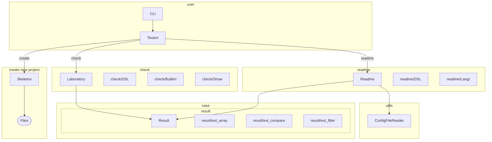
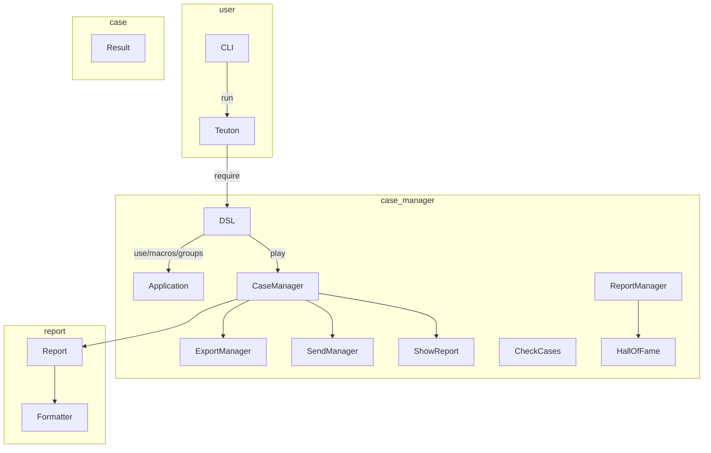

[<<back](../README.md)

# Diagram

```mermaid
flowchart TB

subgraph user
  CLI --> Teuton
end

subgraph "create new project"
  Teuton -- create --> Skeleton
  Skeleton --> Files([Files])
end

subgraph check
  Teuton -- check --> Laboratory

  check/DSL
  check/Builtin!
  check/Show
end

subgraph readme
  Teuton -- readme --> Readme

  readme/DSL
  readme/Lang!  
end

subgraph case

  subgraph result
    Laboratory --> Result
    Readme --> Result
    result/ext_array
    result/ext_compare
    result/ext_filter
  end
end

subgraph utils
  Readme --> ConfigFileReader
end
```

```mermaid
flowchart TB

subgraph user
  CLI -- run --> Teuton
end

subgraph case_manager
  Teuton -- require --> DSL
  DSL -- use/macros/groups --> Application
  DSL -- play --> CaseManager
  CaseManager --> ExportManager
  CaseManager --> SendManager
  CaseManager --> ShowReport
  CheckCases
  ReportManager --> HallOfFame
end

subgraph case
  Result
end

subgraph report
  CaseManager --> Report
  Report --> Formatter
end
```
