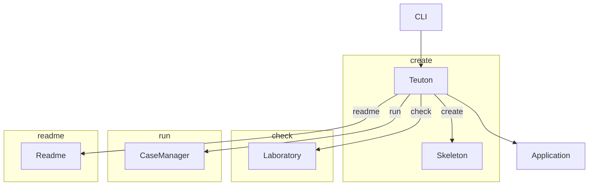

[<<back](../README.md)

# Diagram

```mermaid
flowchart TB

  CLI --> Teuton
  Teuton --> Application

subgraph create
  Teuton -- create --> Skeleton
end

subgraph check
  Teuton -- check --> Laboratory
end

subgraph run
  Teuton -- run --> CaseManager
end

subgraph readme
  Teuton -- readme --> Readme
end
```
