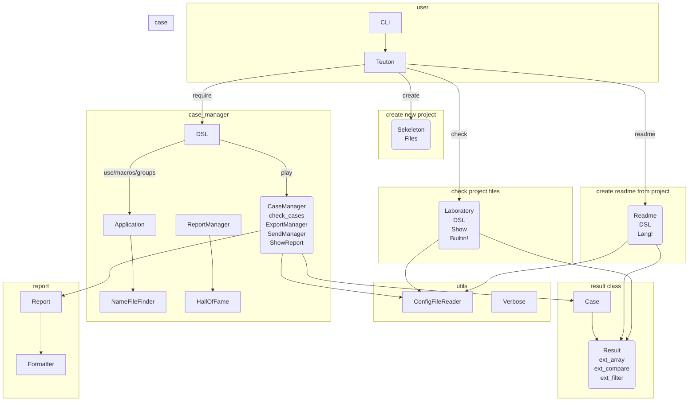

[<<back](../README.md)

# Diagram

```mermaid
flowchart TB

subgraph user
  CLI --> Teuton
end

subgraph "create new project"
  Teuton -- create --> Skeleton("Sekeleton\nFiles")
end

subgraph "check project files"
  Teuton -- check --> Laboratory("Laboratory\nDSL\nShow\nBuiltin!")
end

subgraph "create readme from project"
  Teuton -- readme --> Readme("Readme\nDSL\nLang!")
end

subgraph "result class"
  Laboratory --> Result
  Readme --> Result("Result\next_array\next_compare\next_filter")
  Case --> Result
end

subgraph utils
  Readme --> ConfigFileReader
  Laboratory --> ConfigFileReader
  Verbose
end

subgraph case_manager
  Teuton -- require --> DSL
  DSL -- use/macros/groups --> Application
  Application --> NameFileFinder
  DSL -- play --> CaseManager("CaseManager\ncheck_cases\nExportManager\nSendManager\nShowReport")
  CaseManager --> ConfigFileReader
  ReportManager --> HallOfFame
end

subgraph case
  CaseManager --> Case
end

subgraph report
  CaseManager --> Report
  Report --> Formatter
end
```
