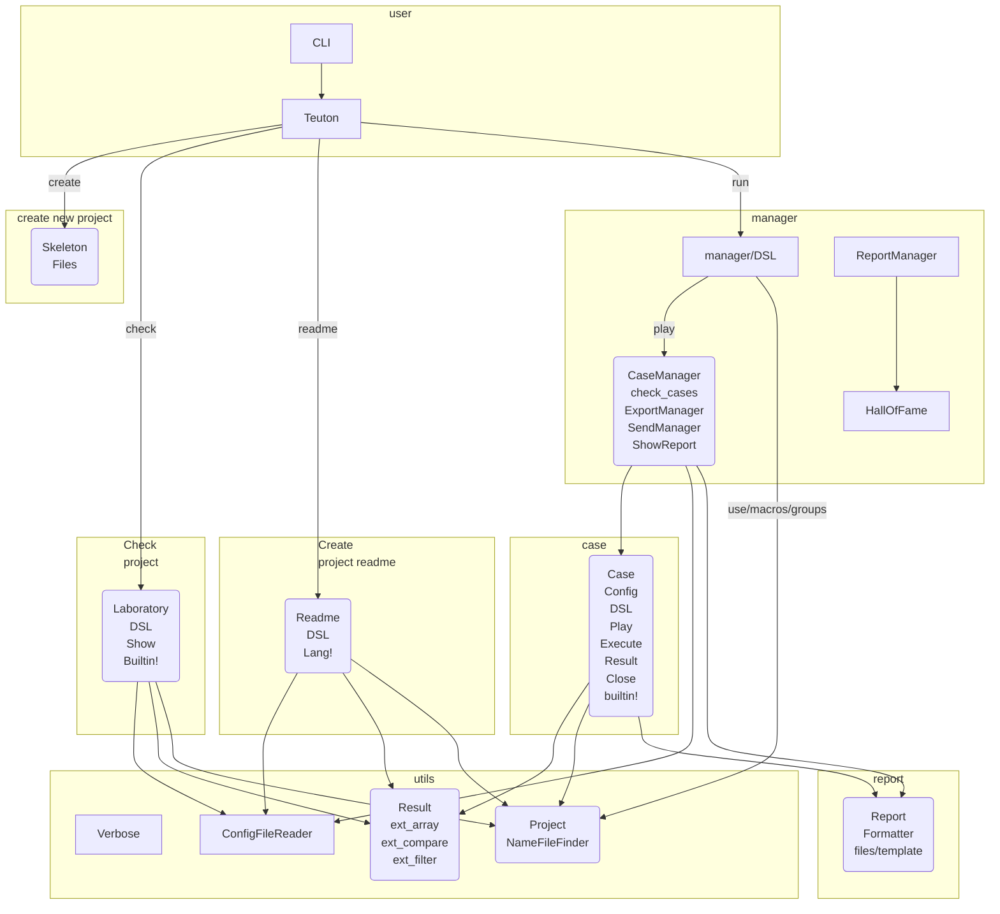

[<<back](../README.md)

# Diagram

```mermaid
flowchart TB

subgraph user
  CLI --> Teuton
end

subgraph "create new project"
  Teuton -- create --> Skeleton("Skeleton\nFiles")
end

subgraph "Check\nproject"
  Teuton -- check --> Laboratory("Laboratory\nDSL\nShow\nBuiltin!")
end

subgraph "Create\nproject readme"
  Teuton -- readme --> Readme("Readme\nDSL\nLang!")
end

subgraph manager
  Teuton -- run --> manager/DSL
  manager/DSL -- play --> CaseManager("CaseManager\ncheck_cases\nExportManager\nSendManager\nShowReport")
  ReportManager --> HallOfFame
end

subgraph "case"
  CaseManager --> Case("Case\nConfig\nDSL\nPlay\nExecute\nResult\nClose\nbuiltin!")
end

subgraph utils
  Verbose

  Readme --> ConfigFileReader
  Laboratory --> ConfigFileReader
  CaseManager --> ConfigFileReader

  Laboratory --> Result
  Readme --> Result("Result\next_array\next_compare\next_filter")
  Case --> Result

  Laboratory --> Project
  Readme --> Project
  manager/DSL -- use/macros/groups --> Project("Project\nNameFileFinder")
  Case --> Project
end

subgraph report
  CaseManager --> Report("Report\nFormatter\nfiles/template")
  Case --> Report
end
```
