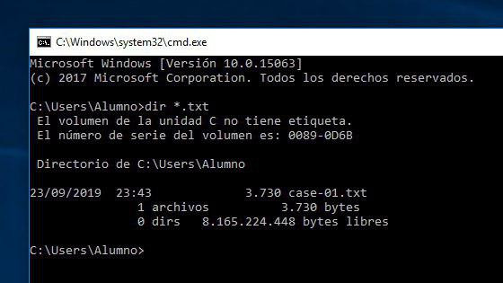

[<< back](../../README.md)

# send

`send` is used to copy Teuton reports into remote machines.

Usage:
```ruby
start do
  export
  send copy_to: :host1
end
```

* `send` instruction must be execute after `export`, because report files must be generated before send them.
* `host1`, label that identify remote host. This information must be configured into config file.
* `send copy_to: :host1`, by default, the home folder of the user `host1_username` is used to copy report on the remote host (`host1_ip`).

## Options

| Option  | Action | Description |
| ------: | ------ | ----------- |
| copy_to | send copy_to: :host1 | Copy report into default directory of remote machine `host1`. |
| prefix | send copy_to: :host1, prefix: "example_" | Case report will be save into default directory on every host `host1`, named as `example_case-XX.txt`. |
| dir    | send copy_to: :host1, dir: "/home/obiwan" | Reports will be saved into "/home/obiwan" directory in remote machine `host1`. |

## Example: Send several reports with diferent formats

If you export several files using differents output formats, you will use several `export` orders. Then when invoke `send` order, this will send the last exported file.

In this example we export html and txt files, but only send txt to remote hosts:

```ruby
start do
  export format: :json
  export format: :txt

  send copy_to: :host1
end
```

If you want to send every exported output file, then do like this:

```ruby
start do
  export format: :html
  send copy_to: :host1

  export format: :txt
  send copy_to: :host1
end
```

## Example: Change remote dir using "dir" options

This example sends `case-01-txt` file to default folder of remote host.

```ruby
play do
  show
  export
  send copy_to: :host1
end
```



Using `dir: "./Desktop"`, report files will be sent to remote host "./Desktop" folder.

```ruby
play do
  show
  export
  send copy_to: :host1, dir: "./Desktop"
end
```
