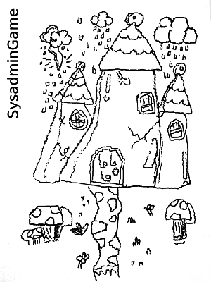

# TEUTON Software

_(Antes se llamaba SysadminGame)_

```
TEUTON son unidades de pruebas para máquinas.
TEUTON comprueba toneladas de objetivos en toneladas de máquinas.
```

Es un DSL para escribir `Unidades de Prueba para todo`. Por ejemplo,
sirve para comprobar si un grupo de máquinas satisface una lista de objetivos o requisitos.



---

# Introducción

*Modo aula*

Es una herramienta Software Libre que podemos usar en una clase con ordenadores
(Laboratorio STEM). *Teuton* ayuda a los profesores a evaluar de forma
remota y automática el trabajo de clase realizado por los alumnos en sus máquinas.

*Modo concurso*

También es útil para usar en concursos o competiciones de administración
de sistemas. Donde los concursantes compiten haciendo su trabajo en máquinas
reales y/o virtuales y al finalizar los jueces ejecutan *Teuton*
para evaluarlas y puntuar a cada concursante. Estoy usando *Teuton* con mis estudiantes.

*Modo retos*

Además se puede instalar el local y usarla para hacer retos en nuestra propia máquina.

**Teuton** está bien, pero se puede mejorar (como todo en la vida).
Me gustaría que otros usuarios (interesados en sistemas y en la educación) la conozcan, y recibir comentarios, sugerencias o colaboraciones para mejorar la herramientas.

¡Muchas gracias!

---

# Descripción

Los pasos para trabajar en el modo aula son:

1. **El profesor define una actividad práctica** para el grupo de estudiantes.
Esto es una lista de objetivos a cumplir, y cómo comprobar dichos objetivos.
1. **Cada estudiante realiza el trabajo de clase** en su propia máquina
Virtual y/o Real.
1. **El profesor ejecuta la herramienta**. La herramienta automáticamente
evalúa los trabajos y crea informes para cada estudiante.

> **NOTA**
> * Las máquinas de los alumnos deben estar accesibles de forma remota por la máquina del profesor.
> * Actualmente se pueden usar los protocolos de acceso remoto
SSH y Telnet.
> * Además el profesor debe tener usuario/clave para entrar en las máquinas de los alumnos.

---

# Demostración rápida

Cada actividad consiste de 2 ficheros. Echemos un vistazo al siguiente ejemplo:

| Fichero | Descripción |
| ------- | ----------- |
| [./docs/examples/example-01.rb](../examples/example-01.rb) | Script que define la actividad o el reto |
| [./docs/examples/example-01.yaml](../examples/example-01.yaml) | Fichero que contiene las configuraciones para cada máquina de cada estudiante (casos) |

Para ejecutar la actividad de ejemplo con [Teuton](./comando.md) haremos:

`./teuton docs/example/example-01.rb`

Pero también son válidas estas otras:

| Ejecutar la demo con Teuton | Descripción |
| --------------------------- | ----------- |
| `./teuton docs/example/example-01.rb | GNU/Linux modo corto |
| `./teuton play docs/example/example-01.rb | GNU/Linux modo largo |
| `ruby teuton docs/example/example-01.rb` | Windows modo corto |
| `ruby teuton play docs/example/example-01.rb` | Windows modo largo |

> **Resultados**
> * Veremos un breve *informe en la pantalla*.
> * los *ficheros de salida* en su versión extendida se guardan en el directorio `./var/example-01/out/`.
> * Existen más actividades en el repositorio de GitHub `dvarrui/teuton-challenges`. Este es un buen sitio donde guardar los scripts que vayamos creando para definir nuestras actividades. Periódicamente irán apareciendo nuevos retos.

---

# Documentación

* [Vídeos](./doc/en/videos.md)
* [Instalación](./instalacion/README.md)
* [Comando Teuton](./comando.md)
* [Ejemplos](./ejemplos/README.md)
* [Creando la primera actividad](./primera-actividad.md)
* [Palabras clave del DSL](./dsl/README.md)
* [Proyecto](./proyectos/servidor-de-retos.md): Montar un servidor de retos

---

# Contacto

* **Correo**: `teuton.software@protonmail.com`
* **Twitter**: `@SoftwareTeuton`
