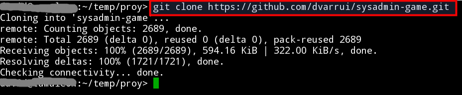
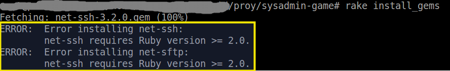

#Instalación

A continuación se indica el proceso de instalación y cuáles son los
paquetes de software requeridos.

##1. Equipo principal o del profesor

Un equipo debe ser el host principal o controlador.
Será el que use el profesor y/o juez de la competición.

###1.1 Software requerido en el host principal
* Software SSH cliente: Se usará para conectar con el resto de máquinas.
> También se puede usar el cliente Telnet.
* `ruby -v` => 2.1.3p242. El programa está desarrollado en `ruby`.
* `rake --version` =>10.4.2. `rake` es como el `make` de `ruby`.

> Comprobar las versiones de `ruby`, `rake`:
> 
>

###1.2 Proceso de instalación en el host principal
* Instalar ruby (`apt-get install ruby` en Debian, `zypper in ruby` en OpenSUSE, etc)
* Instalar rake (`gem install rake`)
* Descargar este proyecto.

> Ejemplo de clonación usado comandos `git`:
> 
>

* `cd sysadmin-game`
* Ejecutar `rake install_gems` para instalar las gemas necesarias en nuestro sistema.

> Error que se produce cuando tenemos una versión incorrecta de `ruby`:
> 

##2. Equipos remotos

Los equipos remotos serán cada uno de los equipos usados por los estudientes
para realizar la actividad. A veces cada estudiante sólo necesitará una máquina,
pero en otros casos cada estudiante puede necesitar más de una.

###2.1 Software requerido en cada equipo remoto o equipo de alumno
* El software de acceso remoto SSH server.
* El usuario del equipo principal debe conocer usuario/clave de cada equipo
remoto con perfil de administrador.

> También podría tener instalado el servidor Telnet.
> En tal caso se usará un usuario, que habrá que crear en cada
máquina de alumno, miembro de los grupos `Administradores` y `TelnetClients`.
