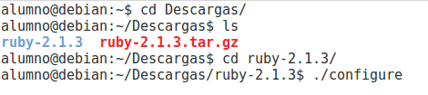
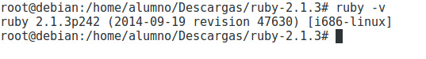
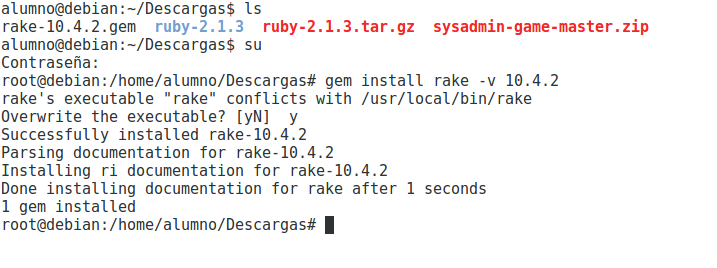
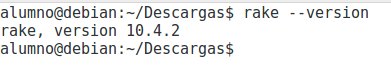
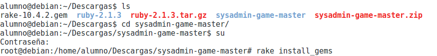
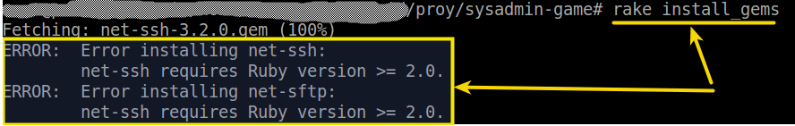
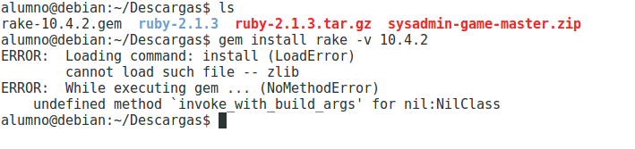
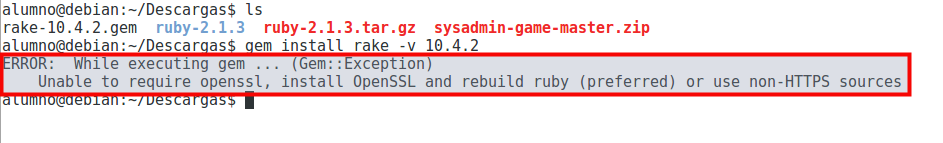
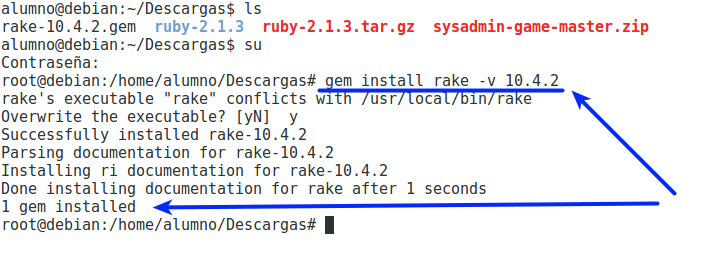

```
Autor: Manuel Martínez Carbonell
```

#HOWTO install Sysadmin-game in Debian 8.6 Jessie

A continuación se indica el proceso de instalación y cuáles son los paquetes
de software requeridos.

El estado de mi máquina en el momento de la instalación de Sysadmin-game es el
siguiente:
* se trata de una máquina virtual (usando VirtualBox 5.0.26)
* con un sistema operativo Debian 8.6 Jessie recién instalado, y
* con las Guest Additions también instaladas.

Antes de proceder con la instalación se recomienda leer el apartado final “Posibles inconvenientes”.

#1. Necesidades del equipo principal o del profesor

Un equipo debe ser el host principal o controlador. Será el que use el profesor y/o juez de la competición.

Software requerido en el host principal:

* Software SSH cliente: Se usará para conectar con el resto de máquinas. > También se puede usar el cliente Telnet.
* `ruby -v` => 2.1.3p242. El programa está desarrollado en ruby.
* `rake --version` =>10.4.2. rake es como el make de ruby.
* Descargar el proyecto Sysadmin-game.

##1.1 Ruby

Ruby ya va por una versión posterior a la 2.1.3.
[Descargar la versión de ruby](https://www.ruby-lang.org/en/news/2014/09/19/ruby-2-1-3-is-released/)

> El proyecto está testado para ruby 2.1.3, por lo que entiendo también funcionará
para versiones superiores

A la hora de instalar Ruby tenemos varias opciones:
* Usar el sistema de gestión de paquetes de la propia distribución (por ejemplo apt-get en Debian)
* Usar instaladores, manejadores para poder cambiar entre distintas versiones de Ruby en el sistema y,
* Compilar el código fuente.

* Enlace para obtener [más información sobre la instalación](https://www.ruby-lang.org/en/documentation/installation/)

##1.2 Compilación del código fuente

En este HOWTO se ha optado por compilar el código fuente.

> Recomendaría instalar desde el código fuente cuando la versión de ruby fuera
menor a 2.1.3. En caso contrario con `apt-get install ruby` tenemos.

Primero nos aseguramos de tener instaladas las siguientes librerías antes de continuar:
```
# apt-get install zlib1g-dev
# apt-get install libssl-dev
```

Luego descargamos la versión necesaria de Ruby, se descomprime el archivo.
Dentro del directorio se ejecuta:
```
$ ./configure
$ make
# make install
```


> * Este es el proceso estándar para compilar código fuente.
> * Enlace sobre [más información sobre la instalación de Ruby](https://www.ruby-lang.org/es/documentation/installation/#building-from-source)

* Comprobamos la versión de Ruby con `# ruby -v`



##1.3 Instalación de rake

* Puedes descargar la versión 10.4.2 de [rake](https://rubygems.org/gems/rake/versions/10.4.2?locale=es).
* En el directorio donde hayas descargado rake se debe ejecutar: `# gem install rake -v 10.4.2`



> Creo que el comando `gem install rake -v 10.4.2` instala descargando la gema
directamente desde los repositorios de internet, y no usa lo ficheros descargados.

* Comprobar la versión de rake con: `$ rake --version`



##1.4 Descargar el proyecto Sysadmin-game

* Descargar y descomprimir el proyecto.
* Entrar el directorio `sysadmin-game-master`.
* Ejecutar `rake install_gems` para que se instalen el resto de las gemas necesarias en nuestro sistema.



> Error que se produce cuando tenemos una versión incorrecta de ruby:
>
> 
>
> Las gemas (librerías de ruby) que se usan, necesitan una versión de ruby
superior a 2.0
> `net-ssh` es la gema que permite la conexión SSH entre las máquinas.

#2. Equipos remotos

Los equipos remotos serán cada uno de los equipos usados por los estudiantes
para realizar la actividad. A veces cada estudiante sólo necesitará una máquina,
pero en otros casos cada estudiante puede necesitar más de una. Cabe señalar
que el host principal o controlador (equipo del profesor) debe tener conexión e
n red con las equipos de los estudiantes.

##2.1 Software requerido en cada equipo remoto o equipo de alumno:

* El software de acceso remoto SSH server.
* El usuario del equipo principal debe conocer usuario/clave de cada equipo remoto con perfil de administrador.

> También podría tener instalado el servidor Telnet.
> En tal caso se usará un usuario, que habrá que crear en cada máquina de alumno,
miembro de los grupos Administradores y TelnetClients.

#3. Posibles inconvenientes

Tras la instalación de Ruby, al intentar instalar rake puede que se produzca el siguiente error:



Para solucionar el error anterior se deben instalar los siguientes paquetes:
```
# apt-get install zlib1g-dev
# apt-get install libssl-dev
```

En caso de que no se instale la librería `libssl-dev`, se obtendría el siguiente
error al intentar instalar `rake`:



Cuando se hayan instalado los dos paquetes anteriores hay que recompilar Ruby
(previamente se debe ejecutar un `make clean`):
```
$ make clean
$ ./configure  > Este paso no es necesario
$ make
# make install
```
Ahora si que se podrá instalar rake sin problemas: `# gem install rake -v 10.4.2`


